## 1. Explain how you can deploy a custom build of a core plugin?
Below are the steps to deploy a custom build of a core plugin:
```sh
 Stop Jenkins.
 Copy the custom HPI to $Jenkins_Home/plugins.
 Delete the previously expanded plugin directory.
 Make an empty file called <plugin>.hpi.pinned.
 Start Jenkins
 ```
## 2. What is the Jenkins job DSL plugin?
The Jenkins Job DSL Plugin is basically the Domain Specific Language (DSL) plugin that allows users to describe jobs using a scripting language named Groovy, the plugin can manage the scripts and updating of the Jenkins jobs which are created and maintain them as a result

## 3. What is CI and CD process?

CI (Continuous integration)
Continuous Integration is a process that helps developers to integrate code into a shared repository several times. Each check-in is verified by an automated build process, allowing teams to detect problems early. 

CD (Continuous delivery)
Continuous delivery is an extension of a continuous integration process which helps to make sure that new changes can be released to the customers quickly in a sustainable way.

## 4. What is meant by the input directives in Jenkins?

With the help of input directives, the user could prompt the inputs with the help of input steps. The stage is paused after different options have been applied and before we can enter to the stage agent to evaluate its condition. Once the input is approved, we could continue with the stage ahead. The parameters that are given as the part of input submission will be available in the environment for the rest of the stage.

## 5. What is meant by scripted pipeline in Jenkins?

The scripted pipeline is very much similar to the declarative pipeline that's built on the top of the underlying pipeline sub-system. The scripted pipeline is based on a general-purpose language based on Groovy. A list of features or benefits that are available in Groovy can be used along scripted pipeline too. In brief, this is a highly flexible tool that can be used in multiple continuous delivery pipelines.

## 6. What is the blue ocean in Jenkins?

Blue Ocean is a project that rethinks the user experience of Jenkins, modeling and presenting the process of software delivery by surfacing information that’s important to development teams with as few clicks as possible, while still staying true to the extensibility that is core to Jenkins. While this project is in the alpha stage of development, the intent is that Jenkins users can install Blue Ocean side-by-side with the Jenkins Classic UI via a plugin.

## 7. What is build pipeline in Jenkins?

A pipeline is a collection of jobs that brings the product from version control under the control of the end clients by utilizing computerization apparatuses. It is an element used to consolidate consistent conveyance in our product advancement work process. Throughout the years, there have been various Jenkins pipeline releases including, Jenkins Build stream, Jenkins Build Pipeline module, Jenkins Workflow, and so forth. What are the key highlights of these modules? They speak to different Jenkins jobs as one entire work process as a pipeline. These pipelines are an accumulation of Jenkins employments which trigger each other in a predefined arrangement.

Let me clarify this with a model. Assume I'm building up a little application on Jenkins and I need to fabricate, test and convey it. To do this, I will distribute 3 employment to play out each procedure. Along these lines, job1 would be for fabricating, job2 would perform tests and job3 for an organization. I can utilize the Jenkins assemble pipeline module to play out this assignment. In the wake of making three employments and binding them in a grouping, the fabricate module will run these occupations as a pipeline.

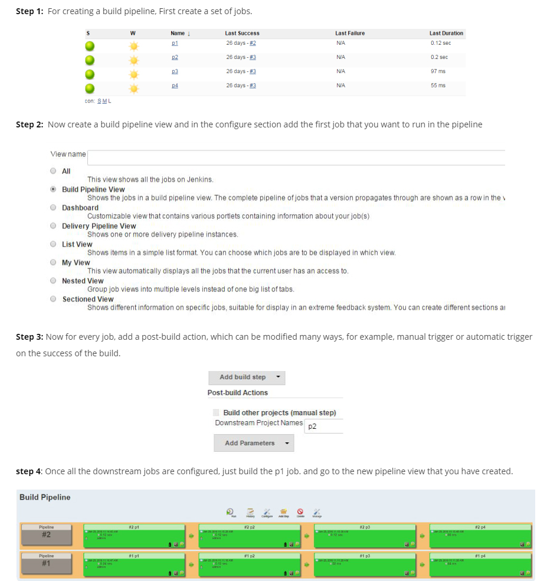

## 8. How do you configure automatic builds in Jenkins?

Works in Jenkins can be activated intermittently (on a timetable, indicated in the arrangement), or when source changes in the task have been distinguished, or they can be naturally activated by mentioning the URL:

http://YOURHOST/jenkins/work/PROJECTNAME/construct

In the undertaking arrangement, there ought to be a Build Triggers area. This controls how frequently Jenkins polls your SCM for code changes. When utilizing SVN, you can stand to check as often as possible in light of the fact that the checking isn't costly. So you can advise Jenkins to check each moment or something like that. Set this to Poll SCM and set the calendar to something like */n * * * * (supplant n with your poll interval in minutes)

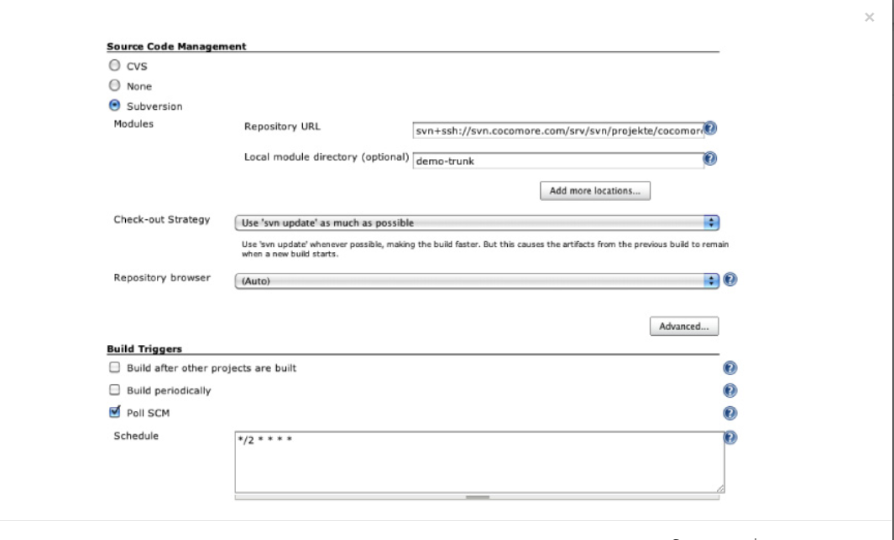

## 9. How to create a backup and copy files in Jenkins?
It is critical to have Jenkins reinforcement with its information and setups. It incorporates, work configs, manufactured logs, modules, module design, etc. Jenkins Thin Backup is a   module for sponsorship up Jenkins. It backs up every one of the information dependent on your timetable and it handles the reinforcement maintenance too.

To begin, first, introduce the module. 

Go to Manage Jenkins – > Manage Plugins
Snap the Available tab and look for “Thin backup”
Introduce the module and restart Jenkins.
Once introduced, pursue the means given beneath for designing reinforcement settings. 

Go to Manage Jenkins — > ThinBackup
Snap settings alternative.
Enter the reinforcement choices as appeared and spare it. Every one of the alternatives is clear as crystal. The reinforcement index you determine ought to be writable by the client which is running the Jenkins administration. All the Jenkins reinforcement will be spared to the reinforcement registry you indicate.

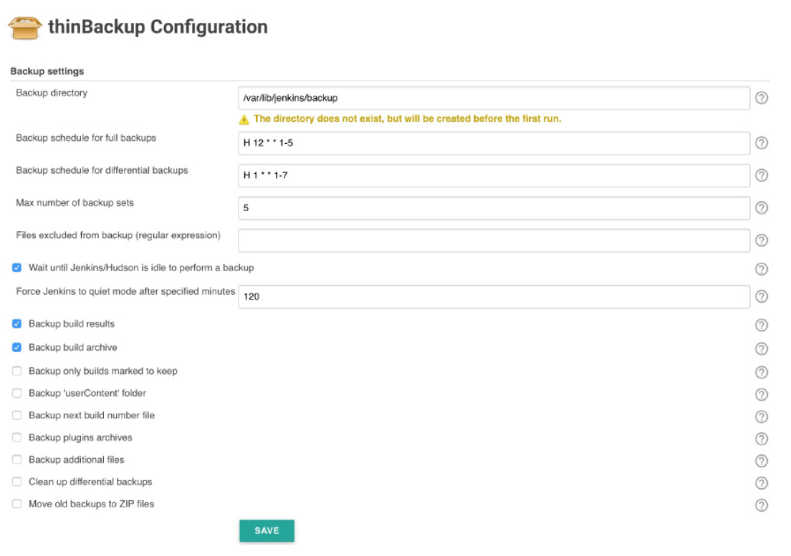

It's anything but a smart thought to keep the Jenkins back in Jenkins itself. It is an absolute necessity to move slim reinforcements to distributed storage or some other reinforcement area. So that, regardless of whether Jenkins server crashes you will have every one of the information. In the event that you are on AWS, Azure or Google CLoud, you can transfer the reinforcements separate stockpiling arrangements.

There is an alternative way of backup of the Jenkins Home folder. This contains all of your build jobs configurations, your slave node configurations, and your build history. To create a backup of your Jenkins setup, just copy this directory.
```sh
You can see where is your Jenkins home with:

echo $JENKINS_HOME
And for example, if you only want to back up the jobs you can go to:

cd $JENKINS_HOME/jobs
And make a backup for that folder.
```
All that configuration will be a bunch of XML files.

## 10. Which Commands Can Be Used To Start Jenkins Manually?
There are various ways to start and stop Jenkins. We have commands/ plug-ins to achieve the same.

Firstly, we can use any one of the below commands to start Jenkins manually using Jenkins URL:

(Jenkins_url)/restart: Forces a restart without waiting for builds to complete.
(Jenkin_url)/safeRestart: Allows all running builds to complete.
We should always do safeRestart as it waits for running build to complete before restarting Jenkin server. There are other ways as well to start/stop. We can go to Open Console/Command line --> Go to our Jenkins installation directory. The below commands also produce the same output:
```sh
to stop:

jenkins.exe stop

to start:

jenkins.exe start

to restart:

jenkins.exe restart
```

## 11. What You Do When You See A Broken Build For Your Project In Jenkins?

We can check the console output in Jenkins to investigate the output of the build. This can help us in identifying if any files change missed during commit. If the console output is of no help we can use a local copy of workspace to replicate the issue.

Last time we had a failing build with Jenkins showing a red ball to prove it. The first place to look when we have a failing build is the console output. You can get to the console output via the main menu on the left of your project page.

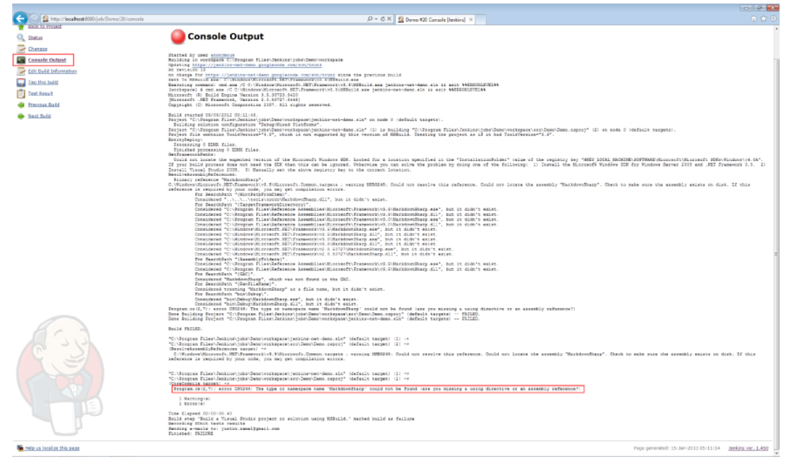

## 12. What is the syntax Jenkins uses to schedule items such as build jobs and SVN polling?
enkins employs the cron syntax to schedule jobs within the tool.

Five asterisks are the core of cron language structure, with every one isolated by a space. The principal asterisk mark speaks to minutes, the second speaks to hours, the third day of the month, the fourth the month itself and the fifth day of the week. For instance, to plan a build job to pull from GitHub each Friday at 6:30 p.m., the language structure would be: 30 18 * 4.

A CRON expression is a string containing five or six fields isolated by space that speaks to a lot of times, regularly as a schedule to execute some everyday practice. In certain employment of the CRON group, there is likewise a seconds field toward the start of the example. In that case, the CRON expression is a string involving 6 or 7 fields. A CRON syntax also supports special  Backing for every special character relies upon explicit appropriations and versions of cron.

* Asterisk( *): The reference mark shows that the cron expression matches for all values of the field. E.g., utilizing an asterisk in the fourth field (month) shows each month.
* Slash(/): Slash portray additions of reaches. For instance, 4-59/15 in the first field (minutes) demonstrates the 4 minute of the hour and every 15 minutes from that point. The structure "*/… " is comparable to the structure "first-last/… ", that is, an addition over the largest possible range of the field.
* The comma (,): Commas are utilized to isolate things of a rundown. For instance, utilizing "MON, WED, FRI" in the fifth field (day of the week) implies Mondays, Wednesdays, and Fridays.
* Hyphen ( – ): Hyphens characterize ranges. For instance, 2000-2010 shows each year somewhere in the range of 2000 and 2010 AD, comprehensive.
* Percent ( %): Percent-signs (%) in the direction, except if got away with a backslash (\), are changed into newline characters, and all information after the first % is sent to the order as standard info.

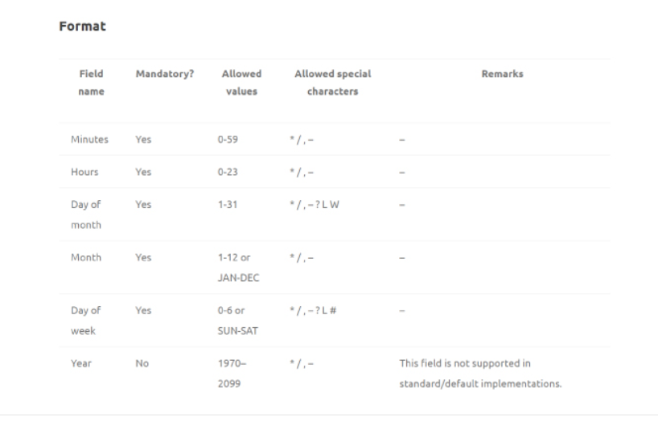

## 13. Describe the standard process to configure and use third-party tools within Jenkins.

The procedure to utilize a third party tool, for example, Artifactory, Node, SonarQube or Git normally pursues a four-advance procedure.

1. The third-party tool must be installed.
2. A Jenkins module that supports the third party tool must be introduced through the Jenkins administrator console.
3. The third-party tool must be arranged in the Tools tab of the Manage Jenkins area of the administrator console.
4. At last, the plug-ins can be utilized from inside a Jenkins build job. The module will at that point encourage correspondence between the Jenkins build job and the third party.

## 14. How can you temporarily turn off Jenkins security if the administrative users have locked themselves out of the admin console?

The JENKINS_HOME organizer contains a document named config.xml. At the point when security is empowered, this record contains an XML component named useSecurity that will be set to true. By changing this setting to false, security will be handicapped whenever Jenkins is restarted. <useSecurity>false</useSecurity> 

The incapacitating security ought to dependably be both a final retreat and a brief measure. When any conformation issues are settled, make certain to re-empower Jenkins security and reboot the CI server.

* Please find the steps below :

Go to $JENKINS_HOME in the file system and discover the config.xml document.
Open this document in the editorial manager.
Search for the <useSecurity>true</useSecurity> component in this document.
Supplant true with false
Expel the components authorization strategy and security realm
Start Jenkins
At the point when Jenkins returns, it will be in an unsecured mode where everybody gets full access to the framework. In the event that this is as yet not working, taking a stab at renaming or erasing config.xml.

## 15. What is the difference between Agent and Node?

Agent: The straightforward answer is, Node is for scripted pipelines & Agent is for declarative pipelines. In declarative pipelines, the agent directive is utilized for determining which agent /slave the job/task is to be executed on. This mandate just enables you to indicate where the undertaking is to be executed, which agent, slave, mark or docker image. In scripted pipelines, the node step can be utilized for executing a script/advance on a particular agent, mark, slave. The node step alternatively takes the operator or name and afterward a conclusion with code that will be executed on that node.

The declarative pipelines is another augmentation of the pipeline DSL (it is fundamentally a pipeline content with just one stage, a pipeline venture with contentions (called directives), these directives ought to pursue a particular language structure. The purpose of this new arrangement is that it is progressively exacting and accordingly ought to be simpler for those new to pipelines, take into account graphical altering and considerably more. scripted pipelines are the fallback for cutting edge prerequisites.

## 16. How do you secure Jenkins?

In the default setup of Jenkins 1.x, Jenkins does not play out any security checks. This implies the capacity of Jenkins to launch procedures and access local files are accessible to any individual who can get to Jenkins web UI and some more.

Securing Jenkins has two viewpoints to it.

1. Access control, which guarantees clients are verified when getting to Jenkins and their activities are approved.
2. Securing Jenkins against outer dangers

You should secure the entrance to Jenkins UI with the goal that clients are validated and suitable arrangement of authorizations are given to them. This setting is controlled for the most part in two ways:

Security Realm, which decides clients and their passwords, just as what groups the clients have a place with.
Approval Strategy, which figures out who approaches what.

You may utilize outside LDAP or Active Directory as the security domain, and you may pick "everybody full access once signed in" mode for approval methodology. Or then again you may let Jenkins run its very own client database, and perform access control dependent on the authorization/client grid.

Some important security considerations:
```sh
Global security ought to be empowered.
Jenkins ought to be incorporated with suitable modules.
Automate the way toward setting rights and benefits.
Limit the physical access to organizers.
Intermittently run security reviews.
```
## 17. How do you create a Job in Jenkins?
As a part of the first step we need to visit the Jenkins URL, once we are on Jenkin page we need to click "New Job", then we need to click on  "Build a free-style software project". The above activity consists of several components: like SCM, for instance, CVS or Subversion where our source code abides. optional triggers to control when builds will be performed by Jenkins.some sort of script that plays out the build(ant, maven, shell script and so on.) where the veritable work happens optional steps to accumulate information out of the build, for instance, archiving the artifacts along with recording Javadoc and test results.

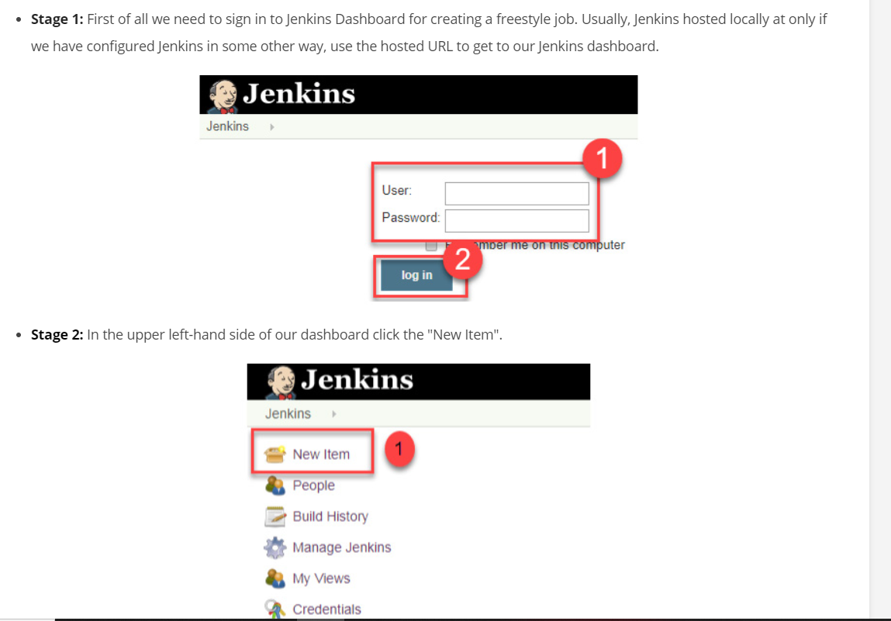

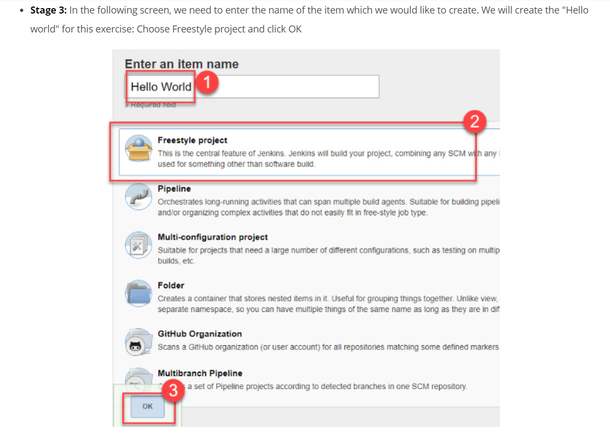

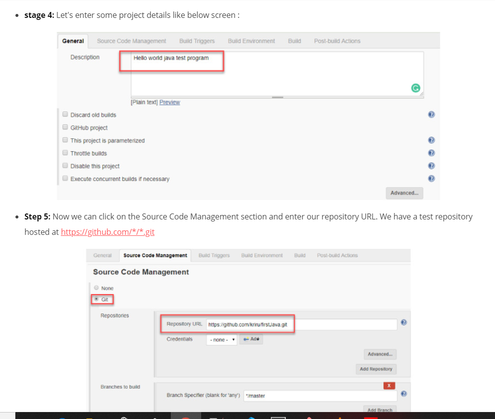

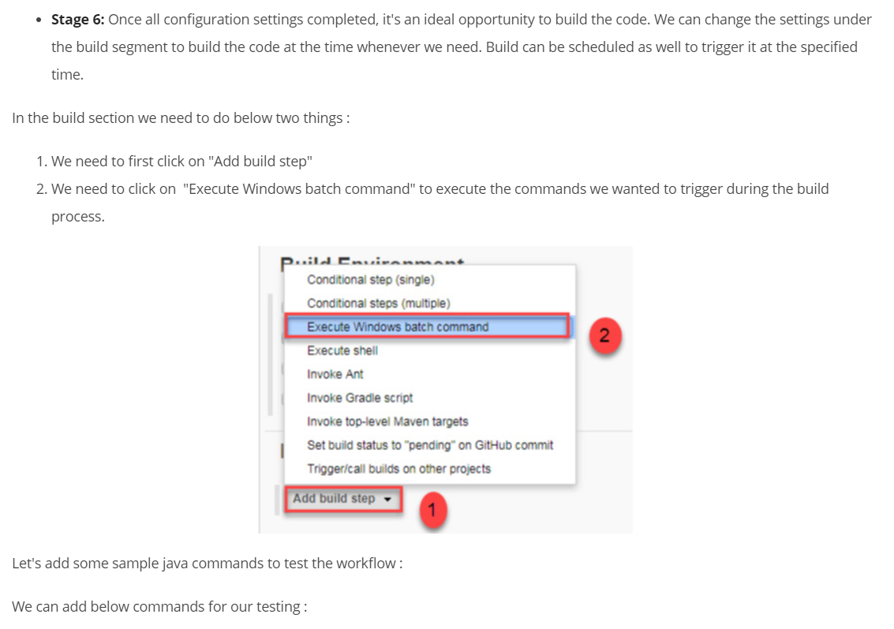

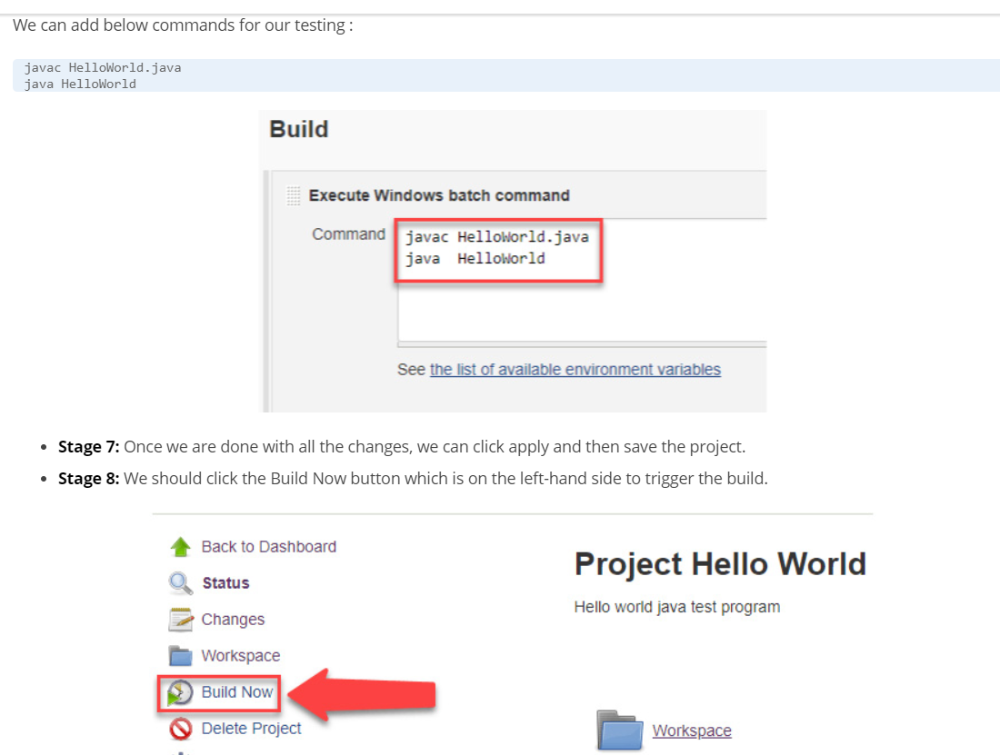

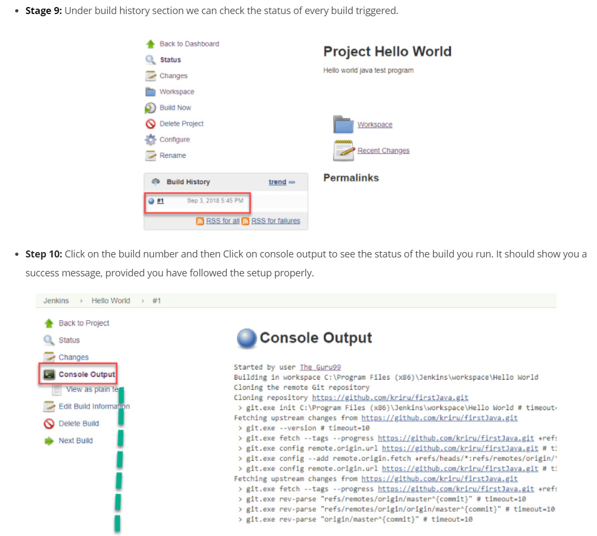

## 18. What Are The Most Useful Plugins In Jenkins?
Some most useful plugins in Jenkins:

* Amazon ECS Container Service
The objective of  ‘Amazon ECS Container Service’ plugin to manage Jenkins agent hosted on the cloud and at the same time helping in deploying Docker-based applications on a cloud. Each Jenkin build is carried out in separate docker container which gets cleaned up after.

* Dashboard View Plugin
This dashboard gives a bird view of the status of tasks configured in Jenkins. This is used for monitoring purposes. It also helps us in tracking the time taken in building jobs which are configured and entire time duration for all the jobs.

* View Job Filters Plugin
It creates views for Jenkins jobs. We can have a view of build status and different triggers.

* Build Pipeline Plugin
This gives us clear sight of jobs making our build pipeline also we can have a better look of upstream and downstream. Additionally, it helps us in defining manual triggers for some tasks which need some customization before executing. It is one of the critical plugins as it has in-built support of scripts which helps in building complex DevOps pipeline.

* Git Plugin
This plug-is needed in case If we need to access the GitHub but at the same time it works as a repository browser for other SCM providers.

* GitHub Integration Plugin
This is one of the basic plug-ins which we need to get the source code from code repository hosted with GIT. It helps us in scheduling build, pulling code base on regular interval from GIT to Jenkin. The build gets triggered automatically once scheduled.

## 19. How will you define the Jenkins agent?

An agent represents the build pipeline or highlighting specific steps where execution will be getting performed or agent location. Inside the pipeline block,  an agent is available at a higher level but it is optional to use stage-level.

1. The agent section determines whether an entire pipeline or particular stage will be part of Jenkins environment driven by where exactly agent section is located. The agent section must be at the top-level and within pipeline block only. You can visit the below URL to get some more details on agent syntax in Jenkin pipeline. .(https://jenkins.io/doc/book/pipeline/syntax/#agent
2. There are many ways to create Agent/Node but we can follow the below tutorial to know about steps to create agent/Node.https://devopscube.com/setup-slaves-on-jenkins-2/
3. The different parameters are supported by Agent to support various use   These parameters actually work at the top level of pipeline block or it can work under stage directive as well.
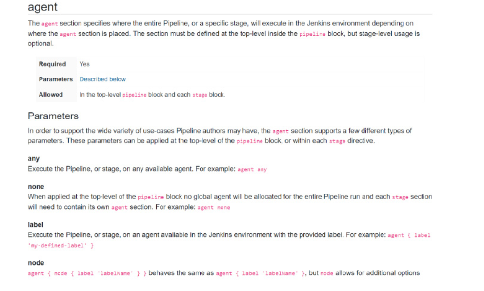

## 20. Name a Jenkins environment variable you have used in a shell script or batch file.
The Jenkins environment variables frequently prove to be useful when you have to keep in touch with some advanced shell contents. Moreover, in the event that you realize how to infuse environment variables into the Jenkins build process, it can open up a totally different universe of specialized chances, as it'll give you access to a portion of the product's internals.

A simple method to get the Jenkins environment variables list from your local installation is to annex env-vars.html to the server's URL. For a privately facilitated Jenkins server, the URL would be http://localhost:8080/env-vars.html. 

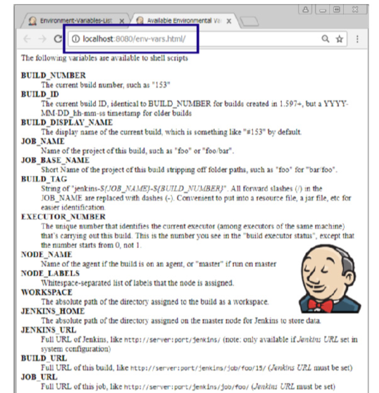

The least demanding approach to perceive how these Jenkins environment variables work is to make a freestyle job, reverberation every section in the rundown and see the value Jenkins relegates to every property. By default, few environment variables are always available in Build Job.  Some of them are available only when a relevant plug-in is configured in Jenkin set up some GIT related variables are available when GIT plugin gets configured.

## 21. Name three steps or stages a typical Jenkins pipeline might include.

Jenkins pipeline is configured to build a project by extracting it from source code and then ensure that the build goes through different stages like unit, performance, and user acceptance testing. Once every stage is successful, it also facilitates deployment to an application server. So overall if we talk about different stages any project goes through can be classified into three broad categories 

* Build -This stage ensures code extracted from code repository for build purpose and in case of any failure, developers come to know the reason for build failure. This is a very critical stage in build pipeline and subsequent stages will be triggered only when the project exits this stage successfully.
* Test - This stage ensures the build is unit /performance/user tested so the issue can be caught at an early stage only.
* Deploy - This stage took care of deployment request once testing is successful It is the last stage in the pipeline.

The above stage can be further divided into smaller sections which help us in understanding the importance of three primary stages of Jenkins pipeline:

* Pull the code from source repository using the proper plug-in. for GIT source code we can utilize GIT plugin and so on.
* Once the code extracted ensure to compile the code using compatible compiler library like Maven Plugin for Java code.
* The conformation with coding standard is also well supported by some of the plugins available in Jenkins. We can use the Checkstyle plugin for the same.
* The Code health check-up is also well supported by different tools available like SonarQube, PMD or FindBugs.
* Incorporating groovy syntax we can get manual sign off from Business users easily.
* We can run different tests to measure application load performance.
* It also helps is packaging application in a form we called ready to deploy stage. For example, the WAR format supported for JAVA web application project, etc.
* It also facilitates deployment of binary to artifacts repository like Nexus.
* It also helps in storing most of the reports for future reference

## 22. Name two ways a Jenkins node agent can be configured to communicate back with the Jenkins master.

There are two ways we can start Jenkins Node agent :

* We can start a Node agent from a browser window itself.
* There is another way of starting an agent from the command line as well.

The JNLP file gets downloaded when we start an agent using a browser window. When this file runs it triggers a separate process to launch Jenkins jobs. There is a different process which runs in case of agent get launched from the command line. There is one JAR file which is required on the client machine and this file gets launched from the command line but still, you need to refer slave agent JNLP file available on Jenkin server. The command line triggers a process on the client machine which actually communicates with Jenkin’s mater and triggers build jobs in Jenkin when it identifies idle clock cycles

## 23. Name five important DevOps tools that organizations should consider adopting when undergoing a DevOps transition?
There are five key areas in which tools can assist in a DevOps transition:

`configuration management:` There are various configuration management tools. For example Chef, Puppet and Ansible are considered to be best configuration management tools.
`source code management:` This helps any enterprise in managing source code in such a way that a distributed team can work efficiently. There are several popular source code tool available like Git, GitHub or GitLab, are few of them to name.
`CI:` Jenkins is leading one in CI tools and most popular one if industry wise trends are considered. There are other CI tools as well like Concourse CI and Atlassian's Bamboo.
`containerization:` docker is a market leader in this section but there are others as well like Rkt and LXD.
`collaboration:` JIRA from Atlassian is an incredible Project Management programming and in the meantime can likewise be an exceptionally solid Collaboration device that can be utilized in an Organization. It is a product device structured particularly to catch, dole out and organize tasks for the advancement of the Project execution. It has one of the basic and natural interfaces that assists anybody with no learning to pick up a grasp over it right away.

## 24. What are declarative pipelines in Jenkins?

Jenkins has two ways of creating pipelines. One is declarative and another one is scripted. The scripted pipelines are also called as traditional pipelines, it is dependent on groovy syntax.  The declarative one is an easy one as syntax is more simplified. Declarative pipeline got introduced after Jenkin version 2.5. Declarative Pipelines are the latest offering from Jenkins that streamline the traditional groovy syntax of Jenkins pipelines (top-level pipeline) with specific use cases, for example, No semicolon can be used as a statement separator. The top-level pipeline ought to be encased inside block viz;

The regular syntax  structure for a declarative pipeline is below :

The declarative pipeline has three major sections explained below :

```sh
Pipeline: The section of the script where we write declarative pipelines. It is an umbrella under which all other sections will reside.
Agent: This is the starting point of a pipeline from where it starts executing.
Stage: The stage is nothing but steps enclosing all pipelines sections.
```
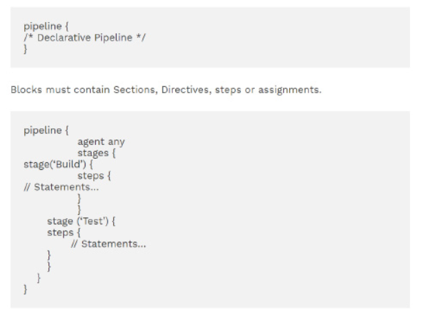

The declarative pipeline has three major sections explained below :

Pipeline: The section of the script where we write declarative pipelines. It is an umbrella under which all other sections will reside.
Agent: This is the starting point of a pipeline from where it starts executing.
Stage: The stage is nothing but steps enclosing all pipelines sections.

## 25. What is backup plugin in Jenkins?

Jenkins Backup Plugin is used to take a back up of the configurations and settings so as to use them later on if there is any failure. We can follow the following steps for backing up our settings by utilizing the Backup Plugin.


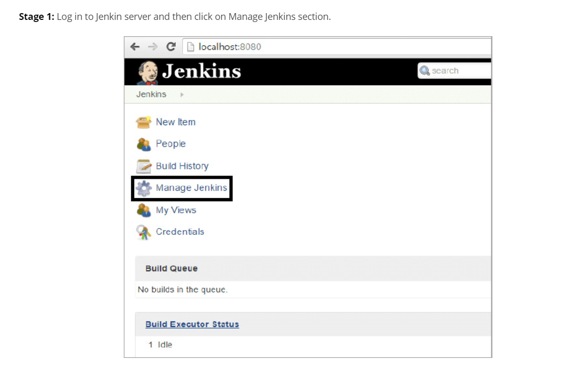

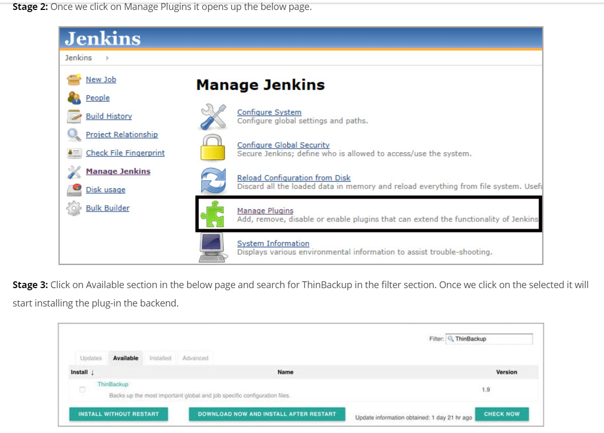

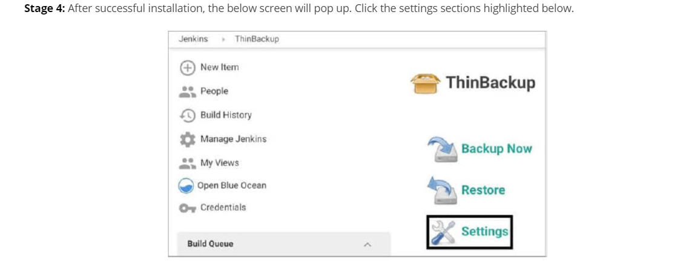

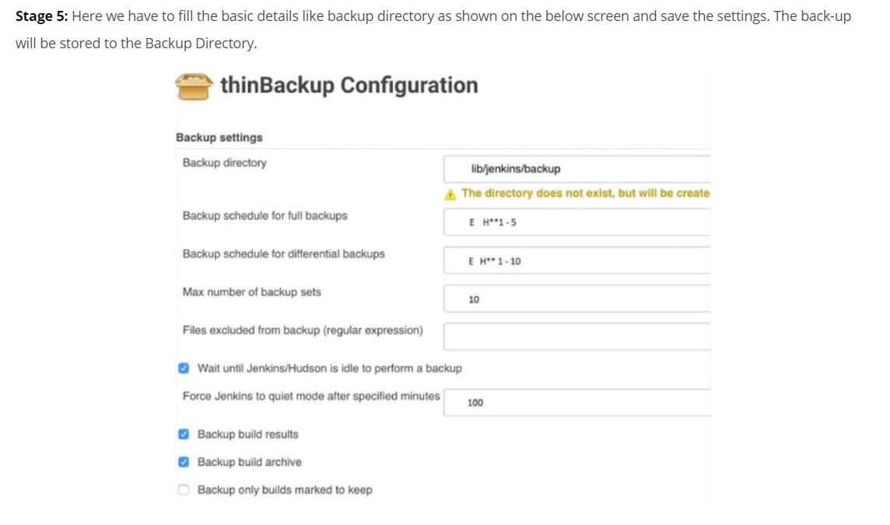

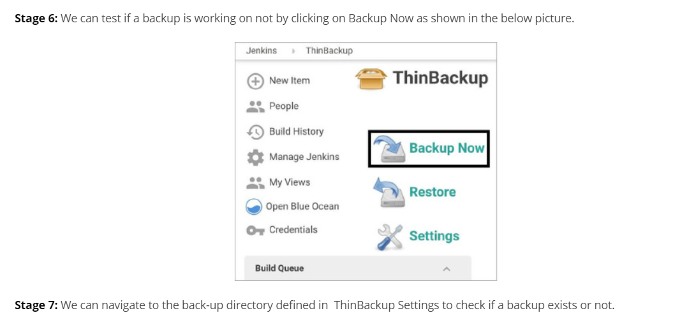
